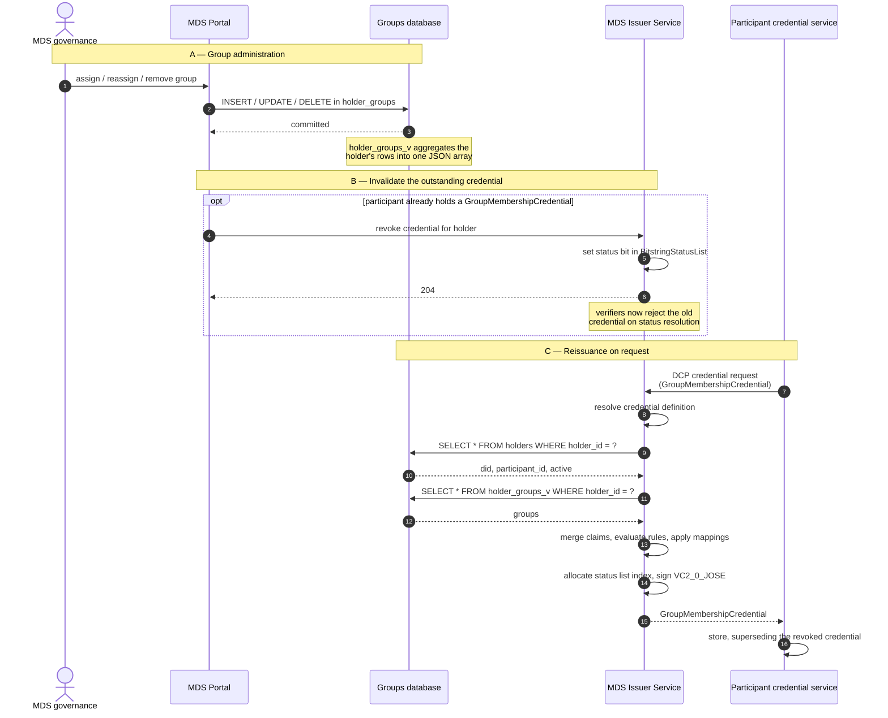

# MDS Verifiable Credentials — 2026/1

> **Status — DRAFT.** This document specifies the verifiable credentials of profile version `2026/1` of the Mobility Data Space dataspace profile. It is not yet released.

## 1. Scope

MDS-specific verifiable credentials a participant presents under the Decentralized Claims Protocol to satisfy MDS policy constraints: for each credential type, what it attests, who may issue it, and the schema it MUST follow.

## 2. Common requirements

| Requirement | Rule |
|---|---|
| Issuer | `did:web` DID under a domain controlled by the MDS credential issuer. A verifier **MUST** reject a credential whose issuer is not in its configured set of trusted issuers for the credential type — a valid signature alone is not sufficient. |
| Subject binding | `credentialSubject.id` **MUST** be the holder's DID and **MUST** equal the DID that authenticates in the presentation exchange. |
| Participant identifier | Every subject carries `participantId`, assigned at onboarding, bound to the `ParticipantId` policy operand. |

## 3. Credentials

### 3.1 MembershipCredential

Attests that the subject is a participant of the Mobility Data Space. 
It is the base credential of the dataspace: a participant holds exactly one, and every other MDS credential presupposes it. 
Issued by the MDS credential issuer once onboarding completes. 
`active` records whether the membership is in good standing.

### 3.2 GroupMembershipCredential

Attests that the subject belongs to one or more MDS groups. 
A group is a set of participants maintained by MDS governance for policy targeting, so a provider can restrict an offer to a category of consumers without enumerating their participant identifiers. 
The set of valid identifiers is maintained by MDS governance and is not fixed by this profile version.

A participant holds at most one GroupMembershipCredential, listing all its groups. 
When a participant's group set changes, the issuer **MUST** revoke the existing credential and issue a replacement. It is meaningful only alongside a valid MembershipCredential; a verifier **MUST NOT** accept it on its own as evidence of MDS membership.

## 4. Policy operand bindings

| Operand | Credential | Subject property |
|---|---|---|
| `ParticipantId` | `MembershipCredential` | `participantId` |
| `Membership` | `MembershipCredential` | `active` |
| `Group` | `GroupMembershipCredential` | `groups` |

## 5. MDS Credential definitions

```json
{
  "id": "mds-membership-credential",
  "credentialType": "MembershipCredential",
  "format": "VC2_0_JOSE",
  "validity": 31536000,
  "attestations": ["mds-membership"],
  "additionalContext": [
    "https://w3id.org/mobility-dataspace/2026/1/credentials/context.jsonld"
  ],
  "jsonSchemaUrl": "https://w3id.org/mobility-dataspace/2026/1/credentials/MembershipCredential.schema.json",
  "mappings": [
    { "input": "participantId", "output": "credentialSubject.participantId", "required": true },
    { "input": "active", "output": "credentialSubject.active", "required": true }
  ]
}
```

```json
{
  "id": "mds-group-membership-credential",
  "credentialType": "GroupMembershipCredential",
  "format": "VC2_0_JOSE",
  "validity": 31536000,
  "attestations": ["mds-membership", "mds-groups"],
  "additionalContext": [
    "https://w3id.org/mobility-dataspace/2026/1/credentials/context.jsonld"
  ],
  "jsonSchemaUrl": "https://w3id.org/mobility-dataspace/2026/1/credentials/GroupMembershipCredential.schema.json",
  "mappings": [
    { "input": "participantId", "output": "credentialSubject.participantId", "required": true },
    { "input": "groups", "output": "credentialSubject.groups", "required": true }
  ]
}
```

## 6. GroupMembershipCredential lifecycle

Groups are administered in the MDS Portal and stored in the groups database that the `mds-groups` attestation reads. 
**A write to the groups database has no effect on a GroupMembershipCredential that has already been issued** — the credential is a signed snapshot taken at issuance time. Changing a participant's groups therefore requires three things: the database write, revocation of the outstanding credential, and a fresh request by the participant.


